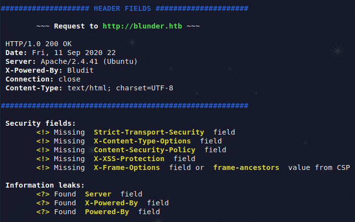

# LiteRespH
Easy HTTP Response Header security fields checker.

### Installation
`git clone https://github.com/PierfrancescoConti/LiteRespH.git`

### Requirements
The script uses `curl` to request the site.

### Execution
During a **Penetration Test**, to report issues about HTTP Resp-H security fields is required. 
Execute this and take an awesome evidence:  
`python3 literesph.py <url/IP>`

### Screenshot

